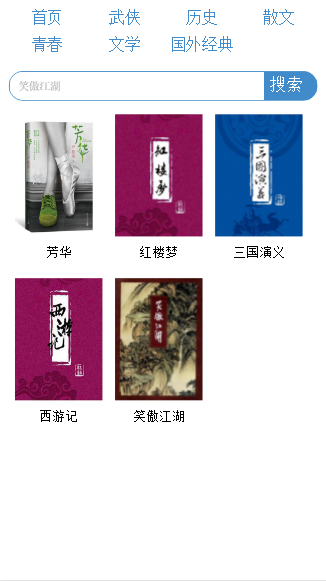
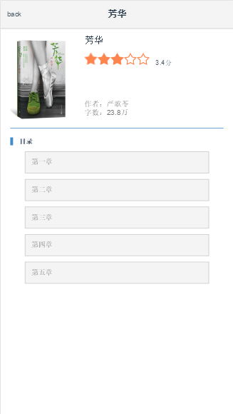
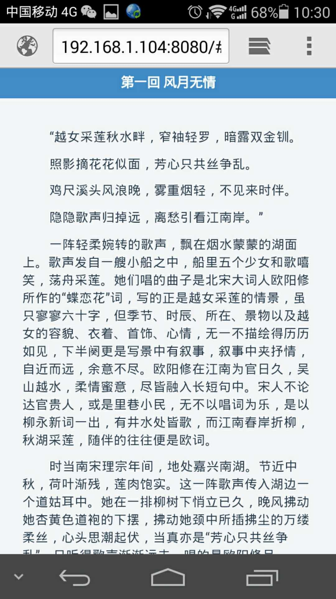

# read(未结)
---
## 技术栈：
---
vue+node+mongodb+ES6+fetch
## 项目运行
---

```
git clone https://github.com/tzcteddy/read.git
cd admin 
npm install
node app.js
```
## 项目结构树
```
.
|-admin                               //node服务目录
| |-moudel                            //MongoDB数据构建目录
| | |-db                              //连接数据、创建数据骨架
| |-public                            //静态文件目录
| | |-
| |-routes                            //路由目录
| | |-book                            //处理图书信息的请求
| | |-index                           //路由入口文件
| | |-login                           //登录信息
| |-view                              //页面存放目录
| | |-index.ejs                       //打包后的单页
| |-app                               //服务启动脚本
| |-check                             //检测是否登录脚本
|-front                               //前端vue项目目录
| |-dist                              //打包后存放目录
| |-src                               //目录
| | |-assets                          //项目所需图片
| | |-components                      //组件目录
| | | |-fengmian                      //封面组件
| | | |-sidebar                       //侧栏组件
| | | |-starscore                     //星星评分组件
| | |-config                          //fetch模拟及配置目录
| | | |-
| | |-page                            //页面目录
| | | |-admin                         //后台页面目录
| | | | |-admin                       //登录页面
| | | | |-book                        //修改章节内容页面
| | | | |-bookdetail                  //修改图书基本信息和目录页面
| | | | |-class                       //修改入口页面
| | | |-book                          //章节内容页面
| | | |-bookdetail                    //图书信息页面
| | | |-class                         //图书列表页面
| | |-router                          //页面路由(vue-router)
| | |-service                         //数据请求配置
| | |-store
| | |-App                             //主页面
| | |_main                            //脚本入口文件
| |-test                              //测试目录
| |-.babelrc                          //babel解析配置文件
| |_index.html                         //入口页面
.
```
## 页面截图展示
 
 